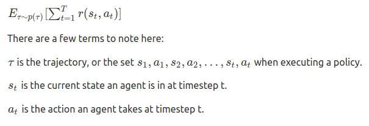
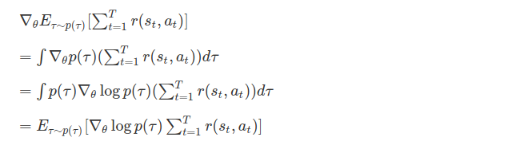
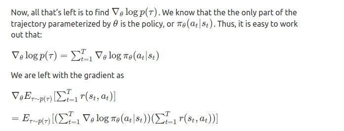
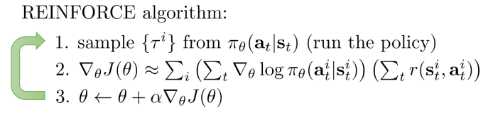

The REINFORCE algorithm is a direct differentiation of the reinforcement learning objective. What is the reinforcement learning objective, you may ask? Well, it is the following:

It makes sense that this is the reinforcement learning objective. Basically, it is the expectation over all different possible paths an agent takes of the sum of its rewards. We can directly differentiate this to get:

This is the essence of the REINFORCE algorithm. By performing gradient descent on this by a Monte Carlo estimate of the expected value, we can find the optimal policy. Note: there are a couple of tricks to make policy gradient work better, such as state-dependent baselines and rewards-to-go, but all of these are variance-reduction techniques and work off of this basic algorithm.

So the pseudo code of REINFORCE algorithm goes in as;

